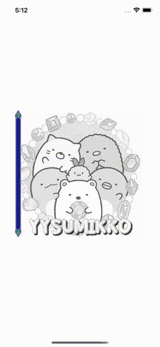

# WWScrollableMaskImageView

[](https://developer.apple.com/swift/) [](https://developer.apple.com/swift/)  [](https://developer.apple.com/swift/) [](https://developer.apple.com/swift/)

Implement draggable mask layer function.

實現可拖動式遮罩層功能。




### [Installation with Swift Package Manager](https://medium.com/彼得潘的-swift-ios-app-開發問題解答集/使用-spm-安裝第三方套件-xcode-11-新功能-2c4ffcf85b4b)

```bash
dependencies: [
    .package(url: "https://github.com/William-Weng/WWScrollableMaskImageView.git", .upToNextMajor(from: "1.0.0"))
]
```

### Example
```swift
final class ViewController: UIViewController {

    @IBOutlet weak var maskView: WWScrollableMaskImageView!
    
    override func viewDidLoad() {
        super.viewDidLoad()
    }
        
    override func viewDidAppear(_ animated: Bool) {
        super.viewDidAppear(animated)
        
        let barImage = UIImage(named: "Bar")
        let barNinePngImage = barImage?.resizableImage(withCapInsets: UIEdgeInsets(top: 30, left: 0, bottom: 30, right: 0), resizingMode: .stretch)
        
        maskView.setting(barImage: barNinePngImage, contentMode: .scaleToFill, color: .clear)
    }
}
```
